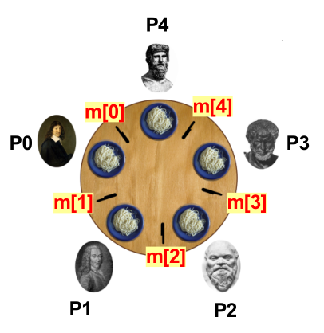

# 前言

Posix（Pthread）线程是C语言处理线程的一个标准接口。Pthreads定义了许多函数，允许程序创建、杀死和回收线程，与对等的线程安全地共享数据，还可以通知对等的线程系统状态的变化。编译时需要加上-pthread的flag。

# 创建多线程

新建一个线程。

## pthread_create

```c
int pthread_create( 
	pthread_t *tid,  //指向线程ID的指针

	const pthread_attr_t *atrr, // 指向线程属性的指针，没特殊需求可以为NULL

	void * (*start_routine) (void *), // 指向线程需要执行的函数指针

	void *arg // 指向参数的指针，任务函数不需要参数时设为NULL，需要参数的话设置为指向struct的指针

);
```

## pthread_join

用来回收线程

```c
int pthread_join( 

	pthread_t tid, // 等待的线程ID

	void ** status, // 退出状态

);
```

```c
#include <stdio.h>
#include <pthread.h>
#define NUMT 10

struct arguments {
    int i;
};

pthread_t thread_ids[NUMT];
struct arguments all_argument[NUMT];

void * task(void * p) {
    printf("the arg is %d\n", ((struct arguments *)p)->i);
    pthread_exit(NULL);
}

int main() {
    int i;
    
    for (i = 0; i < NUMT; i++) {
        all_argument[i].i = i;
        pthread_create(thread_ids + i, NULL, task, all_argument + i);
    }

    for (i = 0; i < NUMT; i++) {
        pthread_join(thread_ids[i], NULL);
    }
}
```

注：thread_ids数组写在main函数里面也是可以的。这是因为线程间是可以互相访问栈空间的。

### 自定义线程返回值

pthread_exit(void *retval)里的retval可以是一个数，或者是一个指向structure的指针

```c
#include <stdio.h>
#include <pthread.h>
#include <stdlib.h>

struct retval {
    int val1;
    int val2;
};


void* task(void* p) {
    // 或者 pthread_exit((void*)21);
    return (void*) 21;
}

void* task2(void* p) {
    struct retval* rt = malloc(sizeof(struct retval));
    rt->val1 = 2;
    rt->val2 = 3;
    pthread_exit(rt);
}

int main() {
    pthread_t pt;
    void* rptr;
    pthread_create(&pt, NULL, task, NULL);
    pthread_join(pt, &rptr);
    printf("Returns %ld\n", (long)rptr);

    pthread_create(&pt, NULL, task2, NULL);
    pthread_join(pt, &rptr);
    struct retval* rtvptr = rptr;
    printf("Returns %d %d\n", rtvptr->val1, rtvptr->val2);
    free(rtvptr);
    
}
```

# 竞态条件（race condition）

当多个线程同时读写一个共享的内存内容，并且最后内存的结果决定于线程执行的先后顺序时，竞争条件发生。

```c
#include <stdio.h>
#include <pthread.h>

#define MAX 3
#define MAX_ITER 1000000

long counter = 0;

void * thread_function(void *arg) {
    long l;
    for (l = 0; l < MAX_ITER; l++) {
        counter = counter + 1; // critical section
    }
}
int main(void) {
    pthread_t mythread[MAX];
    int t = 0;
    for (t = 0; t < MAX; t++) {
        pthread_create(&mythread[t], NULL, thread_function, NULL);
    }
    for (t = 0; t < MAX; t++) {
        pthread_join(mythread[t], NULL);
    }
    printf("Expected counter value: %d, observed counter value: %ld\n",
           MAX_ITER * MAX, counter);
}
```

输出

>   Expected counter value: 3000000, observed counter value: 1350194

这是因为多个线程同时修改count的值。如果两个线程同时读取count的值为1，再同时把他+1，那么最后count只加了1，而不是我们想加的2。所以每当我们操作共享内存时，我们都需要考虑同步。

# 同步方法一：锁

每个线程在进入共享内存区域前上锁，访问完解锁。当锁被锁住时，其他请求锁的线程会阻塞。

```c
#include <stdio.h>
#include <pthread.h>
#include <stdlib.h>

#define MAX_ITER 1000
#define NUMT 4

long count = 0;
//静态初始化锁
pthread_mutex_t mylock = PTHREAD_MUTEX_INITIALIZER;
//动态初始化锁
pthread_mutex_t* dynlock;

void* task(void * arg) {
    for (long i = 0; i < MAX_ITER; i++) {
        pthread_mutex_lock(&mylock);
        count++;
        pthread_mutex_unlock(&mylock);
    }
    pthread_exit(NULL);
}

void* task2(void* p) {
    for (long i = 0; i < MAX_ITER; i++) {
        pthread_mutex_lock(dynlock);
        count++;
        pthread_mutex_unlock(dynlock);
    }
    pthread_exit(NULL);
}

int main() {
    int i;
    pthread_t thread_ids[NUMT];
    
    for (i = 0; i < NUMT; i++) {
        pthread_create(thread_ids + i, NULL, task, NULL);
    }
    for (i = 0; i < NUMT; i++) {
        pthread_join(thread_ids[i], NULL);
    }
    printf("%ld\n",count);

    dynlock = (pthread_mutex_t*) malloc(sizeof(pthread_mutex_t));
    pthread_mutex_init(dynlock, NULL);
    for (i = 0; i < NUMT; i++) {
        pthread_create(thread_ids + i, NULL, task, NULL);
    }
    for (i = 0; i < NUMT; i++) {
        pthread_join(thread_ids[i], NULL);
    }
    printf("%ld\n",count);
    pthread_mutex_destroy(&mylock);
    pthread_mutex_destroy(dynlock);
}
```

## 死锁

不正确地使用同步可能会引发死锁。死锁指的是多个线程在执行过程中，由于竞争条件或彼此通信造成一种阻塞，导致一直等待别的线程。

常见的死锁有self-deadlock和ABBA-deadlock。

self-deadlock：一个线程尝试去请求一个自己已经持有的锁。这时这个线程陷入无尽的等待中。

```c
pthread_mutex_lock(&mylock); // Acquire mylock
pthread_mutex_lock(&mylock); // Try to acquire mylock again!
// Get blocked and wait for ever
```

ABBA：两个线程请求两个锁。一个线程以A-B的顺序请求，另有一个线程以B-A的顺序请求。如果线程0有A锁，在请求B锁，而线程1有B锁，在请求A锁，两个线程谁都不肯让步，进入死锁。

```c
Thread 0:
acquire mutex A
try to acquire mutex B
wait (block) for mutex B

Thread 1:
acquire mutex B
try to acquire mutex A
wait (block) for mutex A#
```

## 死锁必要条件

1.   Mutual exclusion: a resource can be assigned to at most one thread.

2.   Hold and wait: threads both hold resources and request other resources.

3.   No preemption: a resource can only be released by the thread that holds it.

4.   Circular wait: a cycle exists in which each thread waits for a resource that is

assigned to another thread.

## 如何避免

为了避免环，我们需要有个上锁顺序，所有线程以同一个顺序请求锁就不会有死锁。

```
Thread 1:
acquire mutex A
acquire mutex B
acquire mutex C
enter critical section...
release A, B and C

Thread 2:
try to acquire mutex A
wait for mutex A
....
....
....
acquire mutex A
acquire mutex B
acquire mutex C
```

## 哲学家就餐问题

以什么顺序请求锁也是个问题，这里以计算机经典的哲学家就餐问题来作为例子。假设有五位哲学家围坐在一张圆形餐桌旁，做以下两件事情之一：吃饭，或者思考。吃东西的时候，他们就停止思考，思考的时候也停止吃东西。餐桌中间有一大碗意大利面，每位哲学家之间各有一只筷子，哲学家需要先拿到左手边的筷子以及右手边的筷子餐叉，才能开始吃饭。我们创建一个m数组代表筷子，即m[0]是第一根筷子。



哲学家就餐

一个很简单的想法就是每个哲学家先拿左边的筷子，再拿右边的筷子，谁先都拿起来谁就先吃。

```c
void * tfunc (void * arg) {
    long i = (long) arg; // thread id: 0..4
    for (;;) {
    pthread_mutex_lock( &m[i] );
    pthread_mutex_lock( &m[(i + 1) % 5] );
    printf("Philosopher %d is eating...\n", i);
    pthread_mutex_unlock(&m[i]);
    pthread_mutex_unlock(&m[(i + 1) % 5]);
    }
}
```

但是我们发现会出现这种情况：P0拿起m[0]，P1拿起m[1]，P2拿起m[2]，P3拿起m[3]，P4拿起m[4]，当P4想拿起m[0]时，发现已经被P0拿起了，他只能拿着m[4]等待m[0]。这样就是一个死循环了，每个哲学家都只拿着一根筷子，只能一起饿肚子。这时候我们就需要改变一下请求锁的顺序了，都先请求索引低的锁，也可以都请求索引高的锁。

```c
for (;;) {..
    if ( i < ((i + 1) % MAX) ) {
        pthread_mutex_lock(&mtx[i]);
        pthread_mutex_lock(&mtx[(i + 1) % MAX]);
    } else {
        pthread_mutex_lock(&mtx[(i + 1) % MAX]);
        pthread_mutex_lock(&mtx[i]);
    }
    printf("Philosopher %d is eating...\n", i);
    pthread_mutex_unlock(&mtx[i]);
    pthread_mutex_unlock(&mtx[(i + 1) % MAX]);
}
```

# 同步方法二：信号量

信号量（semaphore）s是具有非负整数值的全局变量。Posix中，通过sem_init(sem_t *sem, int pshared, unsigned int value)来初始化一个信号量，value >= 0。信号量只有两种操作：P和V。

-   P(s)：线程会一直阻塞到s变为非零。然后P将s减一，并继续执行之后的指令。在Posix中操作为 sem_wait(sem_t *sem)
-   V(s)：V将s加一 。Posix对应的操作是 sem_post(sem_t *sem)

我们可以使用信号量来解决哲学家就餐为题。如果有n位哲学家，那么用信号量limit限制最多只有n - 1位哲学家能拿起筷子。并且给每根筷子都赋予1的信号量，这时候就不会出现死锁。

```c
#include <stdio.h>
#include <stdlib.h>
#include <pthread.h>
#include <semaphore.h>

#define NTHREADS 5

sem_t chpsticks[NTHREADS];
sem_t limit;

void* dine(void* p) {
    long id = *(long*)p;
    for (int i = 0; i < 3; i++) {
        sem_wait(&limit);
        sem_wait(&chpsticks[id]);
        sem_wait(&chpsticks[(id+1) % NTHREADS]);
        printf("Thinker %ld is eating\n", id);
        sem_post(&chpsticks[id]);
        sem_post(&chpsticks[(id+1) % NTHREADS]);
        sem_post(&limit);
    }
}

int main() {
    long args[NTHREADS];
	pthread_t thinkers[NTHREADS];

    for (int i = 0; i < NTHREADS; i++) {
        sem_init(chpsticks + i, 0, 1);
    }

    sem_init(&limit, 0, NTHREADS - 1);
    
    for (int i = 0; i < NTHREADS; i++) {
        args[i] = i;
        pthread_create(thinkers + i, NULL, dine, args + i);
    }
    for (int i = 0; i < NTHREADS; i++) {
        pthread_join(thinkers[i], NULL);
    }

    sem_destroy(&limit);
    for (int i = 0; i < NTHREADS; i++) {
        sem_destroy(chpsticks + i);
    }
}
```

因为至多有n/2的哲学家能同时用餐，也可以只用一个值为n/2的信号量来同步

```c
#include <stdio.h>
#include <stdlib.h>
#include <stdbool.h>
#include <pthread.h>
#include <semaphore.h>

#define NTHREADS 5

sem_t table;

void* dine(void* arg) {

	const unsigned id = *(unsigned *) arg;

	for (size_t i = 0; i < 100; i++) {
		sem_wait(&table);
		printf("Philosopher %u is eating\n", id);
		sem_post(&table);
	}

	return NULL;
}

int main(void) {

	unsigned args[NTHREADS];
	pthread_t thinkers[NTHREADS];

	sem_init(&table, 0, NTHREADS / 2);

	for (size_t i = 0; i < NTHREADS; ++i) {
		args[i] = i;
		pthread_create(thinkers + i, NULL, dine, args + i);
	}

	for (size_t i = 0; i < NTHREADS; ++i) {
		pthread_join(thinkers[i], NULL);
	}

	sem_destroy(&table);

	return 0;
}
```

# 同步方法三：同步屏障

同步屏障（barrier）等待一定数量的线程达到一点后，才继续执行下面的程序。在Posix中，需要同步的线程调用pthread_barrier_wait(pthread_barrier_t *barrier)。

```c
#include <stdio.h>
#include <pthread.h>
#include <unistd.h>

pthread_barrier_t barrier;

void * thread1(void *not_used) {
    printf("thread1 start\n");
    sleep(2);
    pthread_barrier_wait(&barrier);
    // after this point, all three threads have completed.
    printf("barrier in thread1() done\n");
}

void * thread2(void *not_used) {
    printf("thread2 start\n");
    sleep(5);
    pthread_barrier_wait(&barrier);
    // after this point, all three threads have completed.
    printf("barrier in thread2() done\n");
}

int main() {
    pthread_t thread_ids[2];
    // create a barrier object with a count of 3
    pthread_barrier_init(&barrier, NULL, 3);

    pthread_create(thread_ids, NULL, thread1, NULL);
    pthread_create(thread_ids + 1, NULL, thread2, NULL);

    printf("main () waiting for barrier\n");
    pthread_barrier_wait(&barrier);

    // after this point, all three threads have completed.
    printf("barrier in main() done\n");

    pthread_join(thread_ids[0], NULL);
    pthread_join(thread_ids[1], NULL);

    pthread_barrier_destroy(&barrier);

}
```

# 同步方法四：条件变量

很经典的一个例子就是生产者消费者。一个线程可以使用 pthread_cond_signal() 唤醒其他正在等待的线程。

```c
#include <stdio.h>
#include <pthread.h>

int data_avail = 0; 
pthread_mutex_t data_mutex = PTHREAD_MUTEX_INITIALIZER;
pthread_cond_t data_cond = PTHREAD_COND_INITIALIZER;

void* producer(void* p) {
    printf("Produce data.\n");
    pthread_mutex_lock(&data_mutex);
    
    printf("Insert data.\n");
    data_avail = 1;
    pthread_cond_signal(&data_cond);
    
    pthread_mutex_unlock(&data_mutex);
}

void* consumer(void* p) {
    pthread_mutex_lock(&data_mutex);
    
    while (data_avail == 0) {
        printf("Wait for condition.\n");
        pthread_cond_wait(&data_cond, &data_mutex);
    }

    printf("Extract data.\n");
    
    //if queue is empty data_avail = 0
    
    pthread_mutex_unlock(&data_mutex);
    printf("Cosume data.\n");
}

int main() {
    pthread_t thread_ids[2];
    
    pthread_create(thread_ids, NULL, consumer, NULL);
    pthread_create(thread_ids + 1, NULL, producer, NULL);
    pthread_create(thread_ids + 1, NULL, producer, NULL);
    pthread_create(thread_ids, NULL, consumer, NULL);
    
    pthread_join(thread_ids[0], NULL);
    pthread_join(thread_ids[1], NULL);
    
    pthread_mutex_destroy(&data_mutex);
    pthread_cond_destroy(&data_cond);
}
```

注：pthread_cond_signal()可能会唤起多个线程，只有一个线程会抢到，其他线程需要继续等待。所以pthread_cond_wait()写在while()循环里，如果data_avail是0的话，就继续等待。

condition variable可能会碰到信号丢失的问题。比如下面这个程序，Bob和Alice通过condition variable互相发信息，会发现发了几条后，Bob和Alice都进入等待中。这是因为有时候Bob给Alice发信号，但是Alice没有在听，导致信号丢失，双方就一直在等对方的信号。

```c
#include <stdio.h>
#include <stdbool.h>
#include <pthread.h>

#define EXCHANGES 10000
bool alice_has_mail = false;
bool bob_has_mail = false;
pthread_mutex_t alice_mutex = PTHREAD_MUTEX_INITIALIZER;
pthread_cond_t alice_signal = PTHREAD_COND_INITIALIZER;
pthread_mutex_t bob_mutex = PTHREAD_MUTEX_INITIALIZER;
pthread_cond_t bob_signal = PTHREAD_COND_INITIALIZER;

void *alice(void *arg)
{
    for (unsigned i = 0; i < EXCHANGES; ++i)
    {
        pthread_mutex_lock(&alice_mutex);
        while (!alice_has_mail)
        {
            puts("Alice: Waiting for Bob to signal");
            pthread_cond_wait(&alice_signal, &alice_mutex);
            puts("Alice: Got Bob's signal");
        }
        pthread_mutex_unlock(&alice_mutex);
        alice_has_mail = false;
        bob_has_mail = true;
        pthread_cond_signal(&bob_signal);
        printf("Alice: Got mail (%d) from Bob\n", i);
    }
    return NULL;
}
void *bob(void *arg)
{
    for (unsigned i = 0; i < EXCHANGES; ++i)
    {
        pthread_mutex_lock(&bob_mutex);
        while (!bob_has_mail)
        {
            puts("Bob: Waiting for Alice to signal");
            pthread_cond_wait(&bob_signal, &bob_mutex);
            puts("Bob: Got Alice's signal");
        }
        pthread_mutex_unlock(&bob_mutex);
        alice_has_mail = true;
        bob_has_mail = false;
        pthread_cond_signal(&alice_signal);
        printf("Bob: Got mail (%d) from Alice\n", i);
    }
    return NULL;
}
int main(void)
{
    pthread_t alice_tid;
    pthread_t bob_tid;
    pthread_create(&alice_tid, NULL, alice, NULL);
    pthread_create(&bob_tid, NULL, bob, NULL);
    // start the chain
    bob_has_mail = true;
    pthread_cond_signal(&bob_signal);
    pthread_join(alice_tid, NULL);
    pthread_join(bob_tid, NULL);
    return 0;
}
```

