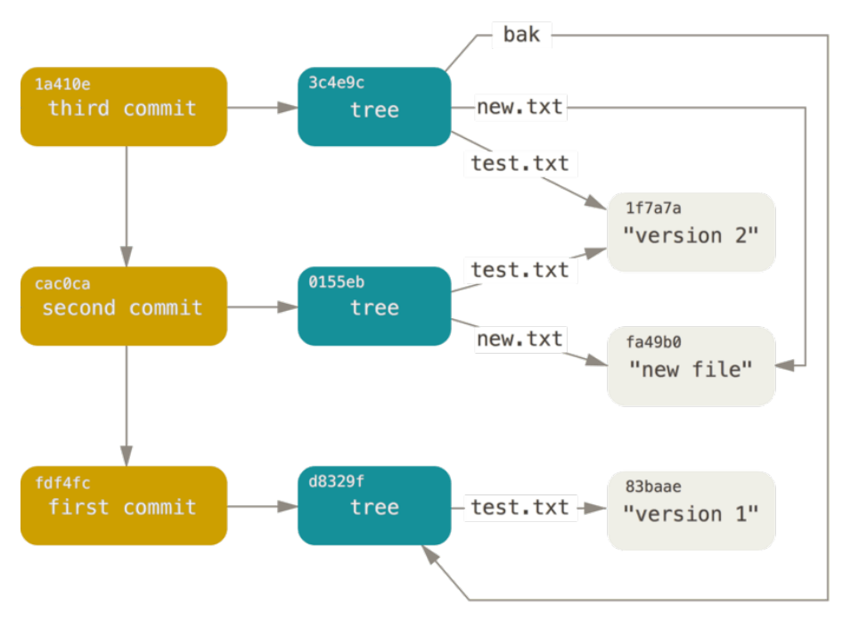
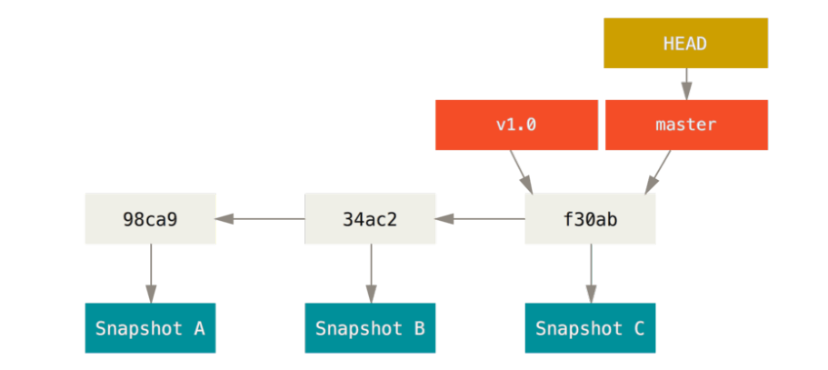
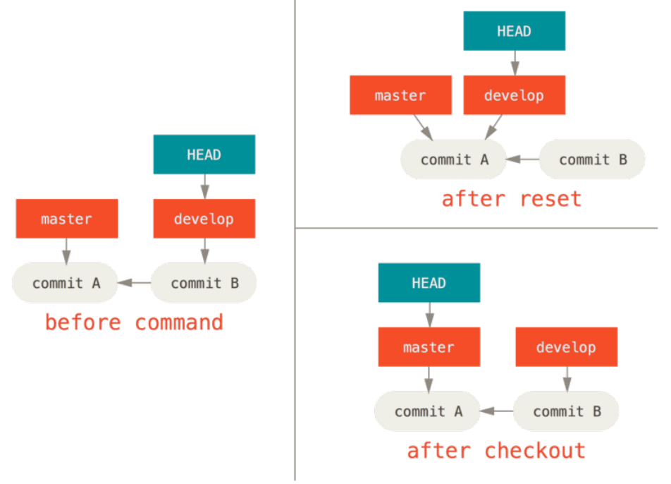

# 用户信息

Commit前记得检查一下自己的用户信息，GitHub上提交记录里显示的就是自己填写的用户信息

-   项目级别/仓库级别：
    仅在当前本地库范围内有效。信息保存位置：./.git/config 文件

    ```bash
    # 查看
    git config --list --local
    # 设置
    git config user.name tom_pro
    git config user.email goodMorning_pro@atguigu.com
    ```
    
-   系统用户级别：
    登录当前操作系统的用户范围。信息保存位置：~/.gitconfig 文件。

    ```bash
    # 查看
    git config --list --global
    # 修改
    git config --global user.name tom_glb
    git config --global user.email goodMorning_pro@atguigu.com
    ```

就近原则：项目级别优先于系统用户级别，二者都有时采用项目级别的签名。

#  底层原理

## .git目录

hooks —— 目录包含客户端或服务端的钩子脚本；
info —— 包含一个全局性排除文件
logs —— 保存日志信息
objects —— 目录存储所有数据内容；
refs —— 分支及其对应的提交对象
config —— 文件包含项目特有的配置选项
description —— 用来显示对仓库的描述信息
HEAD —— 文件指示目前被检出的分支
index —— 文件保存暂存区信息

## blob对象

Git 的核心部分是一个简单的键值对数据库。你可以向该数据库插入任意类型的内容，它会返回一个键值，通过该键值可以在任意时刻再次检索该内容。

-   向数据库写入内容

    ```bash
    $ echo 'test content' | git hash-object -w --stdin
    d670460b4b4aece5915caf5c68d12f560a9fe3e4
    ```

    -w 选项指示 hash-object 命令存储数据对象；若不指定此选项，则该命令仅返回对应的键值
    --stdin（standard input）选项则指示该命令从标准输入读取内容；若不指定此选项，则须在命令尾部给出待存储文件的路径：

    ```bash
    # 存文件
    $ git hash-object -w 文件路径
    # 返回对应文件的键值
    $ git hash-object 文件路径
    ```

-   查看数据库内容

    Git 存储内容的方式：一个文件对应一条内容。校验和的前两个字符用于命名子目录，余下的 38 个字符则用作文件名。

    ```bash
    $ find .git/objects -type f
    .git/objects/d6/70460b4b4aece5915caf5c68d12f560a9fe3e4
    ```

-   根据键值拉取数据

    ```bash
    # 查看对象内容
    $ git cat-file -p d670460b4b4aece5915caf5c68d12f560a9fe3e4
    test content
    
    # 查看对象类型
    $ git cat-file -t d670460b4b4aece5915caf5c68d12f560a9fe3e4
    blob
    ```

    -p 选项可指示该命令自动判断内容的类型，并为我们显示格式友好的内容

问题：

1.   记住文件的每一个版本所对应的 SHA-1 值并不现实
2.   在 Git 中，文件名并没有被保存，我们仅保存了文件的内容

## 树对象

树对象（tree object），它能解决文件名保存的问题，也允许我们将多个文件组织到一起。Git 以一种类似于 UNIX 文件系统的方式存储内容。所有内容均以树对象和数据对象(git 对象)的形式存储，其中树对象对应了 UNIX 中的目录项，数据对象(git 对象)则大致上对应文件内容。一个树对象包含了一条或多条记录（每条记录含有一个指向 git 对象或者子树对象的 SHA-1 指针，以及相应的模式、类型、文件名信息）。一个树对象也可以包含另一个树对象。

步骤：git hash-object 》 git update-index》git write-tree

```bash
$ echo "test.txt v1" > test.txt

$ git hash-object -w ./test.txt
560a3d89bf36ea10794402f6664740c284d4ae3b

# 给blob对象绑定test.txt的名字
$ git update-index --add --cacheinfo 100644 560a3d89bf36ea10794402f6664740c284d4ae3b test.txt
```

文件模式：100644，表明这是一个普通文件100755，表示一个可执行文件；120000，表示一个符号链接。

--add 选项：因为此前该文件并不在暂存区中 首次需要—add

--cacheinfo 选项：因为将要添加的文件位于 Git 数据库中，而不是位于当前目录下， 所有需要--cacheinfo

```bash
# 查看暂存区当前样子
$ git ls-files -s
100644 560a3d89bf36ea10794402f6664740c284d4ae3b 0       test.txt

# 查看版本库，发现只有test.txt的blob对象
$ find .git/objects/ -type f
.git/objects/56/0a3d89bf36ea10794402f6664740c284d4ae3b

# 给暂存区做个快照，生成树对象放到版本库中
$ git write-tree
06e21bb0105e2de6c846725a9a7172f57dd1af96

# 查看类型为tree
$ git cat-file -t 06e21bb0105e2de6c846725a9a7172f57dd1af96
tree

$ git cat-file -p 06e21bb0105e2de6c846725a9a7172f57dd1af96
100644 blob 560a3d89bf36ea10794402f6664740c284d4ae3b    test.txt

# 版本库里一条blob对象，一条树对象
$ find .git/objects/ -type f
.git/objects/06/e21bb0105e2de6c846725a9a7172f57dd1af96
.git/objects/56/0a3d89bf36ea10794402f6664740c284d4ae3b

```

可以简写为`git update-index --add new.txt`，先为new.txt生成blob对象，再执行update-index

问题：

若想重用这些快照，你必须记住所有树的SHA-1 哈希值。 并且，你也完全不知道是谁保存了这些快照，在什么时刻保存的，以及为什么保存这些快照。 

## 提交对象

我们可以通过调用 commit-tree 命令创建一个提交对象，为此需要指定一个树对象的 SHA-1 值，以及该提交的父提交对象（如果有的话 第一次将暂存区做快照就没有父对象）

-   创建提交对象（假设有三个树对象）

    ```bash
    $ echo 'first commit' | git commit-tree d8329f
    fdf4fc3344e67ab068f836878b6c4951e3b15f3d
    ```

-   查看提交对象

    ```bash
    $ git cat-file -p fdf4fc3
    tree d8329fc1cc938780ffdd9f94e0d364e0ea74f579
    author Scott Chacon <schacon@gmail.com> 1243
    committer Scott Chacon <schacon@gmail.com> 1243
    
    first commit
    ```

接着，我们将创建另两个提交对象，它们分别引用各自的上一个提交（作为其父提交对象）：

```bash
$ echo 'second commit' | git commit-tree 0155eb -p fdf4fc3
cac0cab538b970a37ea1e769cbbde608743bc96d

$ echo 'third commit' | git commit-tree 3c4e9c -p cac0cab
1a410efbd13591db07496601ebc7a059dd55cfe9
```



# 本地命令

## log

```bash
# 查看整个项目的分支图  
$ git  log --oneline --decorate --graph --all
```

## 分支

Git 的分支本质上仅仅是指向提交对象的可变指针



-   master至少得有一次commit才能创建branch

-   从master分支切换到其他分支时，注意先要commit下，不然所有在master分支里的改的文件会overwrite其他分支的文件，其他分支也会overwrite master里的文件。

```bash
# 查看分支列表
$ git branch

# 查看分支指向的最新的提交
$ git branch -v

# 在当前提交对象上创建新的分支
$ git branch name

# 在指定的提交对象上创建新的分支
$ git branch name commithash

# 切换分支
$ git checkout name

# 删除空的分支 删除已经被合并的分支
$ git branch -d name

# 强制删除分支
$ git branch -D name
```

## 存储

有时，当你在项目的一部分上已经工作一段时间后，所有东西都进入了混乱的状态，而这时你想要切换到另一个分支做一点别的事情。 问题是，你不想仅仅因为过会儿回到这一点而为做了一半的工作创建一次提交

```bash
# 将未完成的修改保存到一个栈上，而你可以在任何时候重新应用这些改动(git stash apply)
$ git stash 命令会

# 查看存储
$ git stash list
 
# 如果不指定一个储藏，Git 认为指定的是最近的储藏
$ git stash apply stash@{2}

# 来应用储藏然后立即从栈上扔掉它
git stash pop 

# 加上将要移除的储藏的名字来移除它
git stash drop 
```

## 撤销

```bash
工作区
    如何撤回自己在工作目录中的修改 : git checkout -- filename
暂存区
    如何何撤回自己的暂存  : git reset HEAD filename
版本库              
    如何撤回自己的提交    : git commit --amend
        1.注释写错了,重新给用户一次机会改注释 2.忘记提交最新版本的文件
```

### reset

```bash
三部曲
    第一部： git rest --soft HEAD~   
        只动HEAD (带着分支一起移动)    
        注：git commit --amend原理就是先git rest --soft HEAD~把HEAD往前移一个版本，再commit，HEAD就指向新版本了
        
    第二部: git reset [--mixed]   HEAD~ 
        动HEAD   (带着分支一起移动)  
        动了暂存区
        
    第三部:  git reset --hard  HEAD~   
         动HEAD   (带着分支一起移动)  
         动了暂存区
         动了工作目录
```

若指定了一个文件路径，reset 将会跳过第 1 步，并且将它的作用范围限定为指定的文件或文件集合：

假如我们运行 `git reset file.txt` （这其实是 `git reset --mixed HEAD file.txt` 的简写形式），它只会将 file.txt 从 HEAD 复制到索引中

### checkout

-   不带文件路径

    运行 git checkout [branch] 与运行 git reset --hard [branch] 非常相似，它会更新三者使其看起来 [branch]，不过有两点重要的区别：

    -   首先不同于 reset --hard，checkout 对工作目录是安全的，它会通过检查来确保不会将已更改的文件弄丢。而 reset --hard 则会不做检查就全面地替换所有东西。
    -   第二个重要的区别是如何更新 HEAD。 reset 会移动 HEAD 分支的指向，而 checkout 只会移动 HEAD 自身来指向另一个分支。例如，假设我们有 master 和 develop 分支，它们分别指向不同的提交；我们现在在 develop 上。 如果我们运行 git reset master，那么 develop 自身现在会和 master 指向同一个提交。 而如果我们运行 git checkout master 的话，develop 不会移动，HEAD 自身会移动。 现在HEAD 将会指向 master。所以，虽然在这两种情况下我们都移动 HEAD 使其指向了提交 A，但做法是非常不同的。reset 会移动 HEAD 分支的指向，而 checkout 则移动 HEAD 自身。



-   带文件路径

```bash
# 将会跳过第1步的（就是说不会移动HEAD），更新暂存区和工作目录
$ git checkout commithash <file>

# 只更新工作目录
$ git checkout -- <file>

假如HEAD里是v1，暂存区是v2，工作区是v3。git checkout -- filename会把工作区变成v2，git checkout HEAD <file> 会把工作区和暂存区变成v1
```

## Tag

```bash
# 打标签
$ git tag v1.4
$ git tag v1.4 commitHash

# 推送标签
$ git push origin [tagname]
# 把所有不在远程仓库 服务器上的标签全部传送到那里
$ git push origin --tags

# 删除标签
$ git tag -d v1.4
# 应该注意的是上述命令并不会从任何远程仓库中移除这个标签，你必须使用 git push <remote> :refs/tags/<tagname> 来更新你的远程仓库：
$ git push origin :refs/tags/v1.4
```

# 远程仓库

-   添加远程仓库

    ```bash
    $ git remote add <shortname> <url>
    ```

-   显示远程仓库使用的 Git 别名与其对应的 URL

    ```bash
    $ git remote –v
    ```

-   移除远程仓库

    ```bash
    $ git remote rm [remote-name]
    ```

远程跟踪分支是远程分支状态的引用。它们是你不能移动的本地分支。当你做任何网络通信操作时，它们会自动移动。它们以 (remote)/(branch) 形式命名，例如，如果你想要看你最后一次与远程仓库origin通信时master分支的状态，你可以查看 origin/master 分支

## push

推送本地分支上的内容到远程仓库

```bash
$ git push 别名 分支
```

例：git push demo hot-fix 会把自己本地库的hot-fix分支上传到github里，gitbuh里的分支名也会叫hot-fix

注意：push 是将本地库代码推送到远程库，如果本地库代码跟远程库代码版本不一致，push 的操作是会被拒绝的。也就是说，要想 push 成功，一定要保证本地库的版本要比远程库的版本高！因此一个成熟的程序员在动手改本地代码之前，一定会先检查下远程库跟本地代码的区别！如果本地的代码版本已经落后，切记要先 pull 拉取一下远程库的代码，将本地代码更新到最新以后，然后再修改，提交，推送！

## pull

将远程仓库对于分支最新内容拉下来后与**当前**本地分支直接合并，相当于fetch+merge。

```bash
$ git pull 远程库地址别名 远程分支名
```

从github pull时，如果文件有冲突，也会进入冲突处理模式

# .gitignore

.gitignore只能忽略那些原来没有被track的文件，如果某些文件已经被纳入了版本管理中，则修改.gitignore是无效的。

需要使用git rm --cached把文件从暂存区域移除（从跟踪清单中删除）

```
git rm -r --cached dir
```

