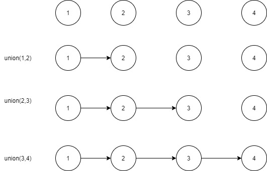
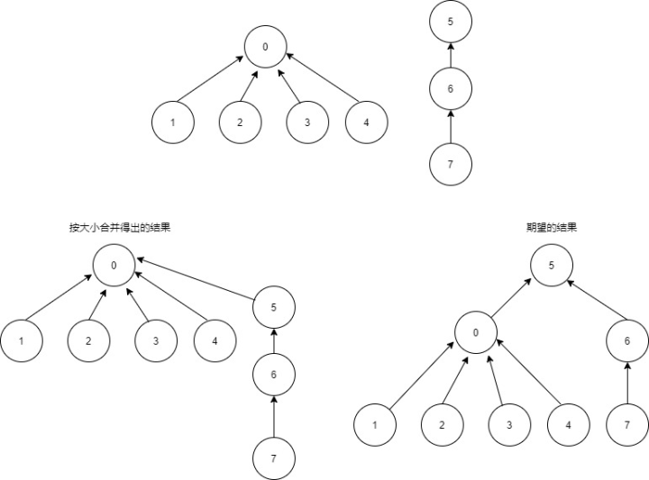

# 简介

并查集（disjoint-set）是一种数据结构，用于处理一些元素的合并与查询问题。通常是解决连通性问题，因为连通性问题只要求程序能够判别给定的元素p，q是否相连，但并没有要求求出两者之间的通路上的连接（如果需要求路线的话，就需要用到图）。

简单介绍下术语，”元素p和元素q是相连的“中的”相连“是一种等价关系，等价关系意味着：

-   自反性：p和p是相连的
-   对称性：如果p和q是相连的，那么q和p也是相连的
-   传递性：如果p和q是相连的且q和r是相连的，那么p和r也是相连的

这种等价关系把元素分为多个等价类。当且仅当两个元素相连时，他们属于同一个等价类。这种等价类一般被称为连通分量或简称分量。

下面是一个并查集基本的API，基本操作是：初始化、连接两个元素、判断某个元素所在分量、判断两个元素是否存在于同一个分量之中、返回所有分量的数量。

| public class UF |                         |                                    |
| --------------- | ----------------------- | ---------------------------------- |
|                 | UF(int N)               | 初始化N个元素                      |
| void            | union(int p,  int q)    | 在p和q之间添加一条连接             |
| int             | find(int p)             | 返回p所在的分量的标识符            |
| boolean         | connected(int p, int q) | 如果p和q存在与同一个分量则返回true |
| int             | count()                 | 连通分量的数量                     |

# UF的整体框架

```java
public class UF {
    //分量id
    private int[] id;
    //分量数量 
    private int count;

    public UF(int n) {
        //一开始所有元素都是不相连的
        count = n;
        id = new int[n];
        for (int i = 0; i < n; i++) {
            id[i] = i;
        }
    }

    public int count() {
        return count;
    }

    public boolean connected(int p, int q) {
        return find(p) == find(q);
    }

    public int find(int p) {
        //实现见下文
    }

    public void union(int p, int q) {
        //实现见下文
    }
}
```

接下来我们重点讨论find和union的实现以及优化

# Find和Union的实现与优化

## 实现方法一：快速查找

把在同一个连通分量中的所有点的id设为一样（根结点）。当且仅当 id[p] 等于 id[q] 时，p和q是连通的。为此在每次union时，必须将两个集合中的所有点对应的 id[] 元素变为同一个值。

>   特点：查找速度很快，但union需要扫描整个数组，无法处理大型问题。

```java
    public int find(int p) {
            return id[p];
        }

    public void union(int p, int q) {
        int pID = id[p];   
        int qID = id[q];  

        // p和q以及在同一个连通分量
        if (pID == qID) return;
        //遍历id数组，把集合p和q的id设置为一样
        for (int i = 0; i < id.length; i++) {
            if (id[i] == pID) id[i] = qID;
        }
        count--;
    }
```

## 实现方法二：快速合并

每一个节点指向自己的父节点（把维护数组 id 改成维护一个数组 parent，使parent[i] = i 的父元素）。查找过程, 查找元素所对应的id，不断去查询自己的父亲节点, 直到到达根节点。

>   特点：O(h) 复杂度, h 为树的高度。合并元素 p 和元素 q 所属的集合，分别查询两个元素的根节点，使其中一个根节点指向另外一个根节点，两个集合就合并了。

```java
public class QuickUnionUF {
    private int[] parent;  // parent[i] = parent of i
    private int count;     // number of components

    public QuickUnionUF(int n) {
        parent = new int[n];
        count = n;
        for (int i = 0; i < n; i++) {
            parent[i] = i;
        }
    }

    public int find(int p) {
        while (p != parent[p])
            p = parent[p];
        return p;
    }

    public void union(int p, int q) {
        int rootP = find(p);
        int rootQ = find(q);
        if (rootP == rootQ) return;
        parent[rootP] = rootQ; 
        count--;
    }

    public int count() {
        return count;
    }

    public boolean connected(int p, int q) {
        return find(p) == find(q);
    }
}
```

这已经比快速查找实现会好了很多。但是这个实现有个问题，最坏情况是执行union(1,2), union(2, 3), union(3, 4)...，如下图所示，树的高度就会变成O(n)，查找和合并都变成O(n)了，一点都不“快速”。




所以我们需要进一步优化合并，使树尽量平衡，一般是两种优化方法：按大小合并和按秩合并。

### 合并优化思路一：按大小合并

与其在union()中随意将一棵树连接到另一棵树，不如将较小的树合并到较大的树上去。用size数组纪录每个树的大小，合并时，比较两个树的大小，较大的那棵树成为父亲。如果一样大的话，那一棵树成为父亲都可以。

```java
public class WeightedQuickUnionUF {
    private int[] parent;   // parent[i] = parent of i
    private int[] size;     // size[i] = number of elements in subtree rooted at i
    private int count;      // number of components

    public WeightedQuickUnionUF(int n) {
        count = n;
        parent = new int[n];
        size = new int[n];
        for (int i = 0; i < n; i++) {
            parent[i] = i;
            size[i] = 1;
        }
    }

    public int count() {
        return count;
    }

    public int find(int p) {
        while (p != parent[p])
            p = parent[p];
        return p;
    }

    public boolean connected(int p, int q) {
        return find(p) == find(q);
    }


    public void union(int p, int q) {
        int rootP = find(p);
        int rootQ = find(q);
        if (rootP == rootQ) return;

        // make smaller root point to larger one
        if (size[rootP] < size[rootQ]) {
            parent[rootP] = rootQ;
            size[rootQ] += size[rootP];
        }
        else {
            parent[rootQ] = rootP;
            size[rootP] += size[rootQ];
        }
        count--;
    }
}
```

按大小合并也可能出现问题，比如下图，以0为根的那棵树虽然 size 大，但是高度较小。按大小合并的策略会把以5为根的树合并到以0为根的树上去，树的高度会增加。而我们期望的是另一方向合并，如期望的结果所示，树的高度为2，而按大小合并的结果的高度则有3。




### 合并优化思路二：按秩合并

按秩合并给每个元素纪录了一个秩（rank），代表着以这个元素为根的树的高度的上限 (upper bound for its height)。最开始，每个元素的秩都是0。当合并两棵树时，对比他们的秩，秩较大的那棵树的根将作为另一个根的父亲。

注意：

-   只有根节点的秩有意义，非根节点的秩是没有意义的。
-   虽然秩是由高度决定的，但是我们是不直接纪录高度，因为树的高度在查找过程中可能会变（由于下文介绍的路径压缩），但秩代表的是一个上限，是不变的，所以纪录秩是更高效的做法。

```java
    ...
    private int[] rank; 
    private int[] parent; 
    private int count;    

    ...

    public UF(int n){
        rank = new int[n];
        parent = new int[n];
        this.count = count;

        for( int i = 0 ; i < n ; i ++ ){
            parent[i] = i;
            rank[i] = 0;
        }
    }

    ...

    public void union(int p, int q){
        int pRoot = find(p);
        int qRoot = find(q);
        if( pRoot == qRoot )
            return;

        if ( rank[pRoot] < rank[qRoot] ) {
            parent[pRoot] = qRoot;
        }
        else if ( rank[qRoot] < rank[pRoot]) {
            parent[qRoot] = pRoot;
        }
        else { 
            parent[pRoot] = qRoot;
            rank[qRoot] += 1;
        }
    }
    ...
```

## 查询优化：压缩路径

在理想状态下，我们希望每个结点都直接连接到它的根结点上，但我们又不想像快速查找算法那样通过修改大量连接做到这点。要实现路径压缩，其实只需要为 find() 添加一个递归，查找返回时顺便将在路径上所有遇到的结点都直接链接到根结点。得到的结果是几乎完全扁平的树，这跟快速查找算法理想情况下所得到的树非常接近。

```java
private int find(int p) {
    if (p != parent[p])
        parent[p] = find(parent[p]);
    return parent[p];
}
```

# 最优实现

```java
public class UF {
    private int[] parent;  // parent[i] = parent of i
    private int[] rank;
    private int count;     // number of components

    public UF(int n) {
        count = n;
        parent = new int[n];
        rank = new int[n];
        for (int i = 0; i < n; i++) {
            parent[i] = i;
            rank[i] = 0;
        }
    }

    public int find(int p) {
        if (p != parent[p])
            parent[p] = find(parent[p]);
        return parent[p];
    }

    public int count() {
        return count;
    }

    public boolean connected(int p, int q) {
        return find(p) == find(q);
    }

    public void union(int p, int q) {
        int rootP = find(p);
        int rootQ = find(q);
        if (rootP == rootQ) 
            return;

        // make root of smaller rank point to root of larger rank
        if (rank[rootP] < rank[rootQ]) {
            parent[rootP] = rootQ;
        } 
        else if (rank[rootP] > rank[rootQ]) {
            parent[rootQ] = rootP;
        } 
        else {
            parent[rootQ] = rootP;
            rank[rootP]++;
        }
        count--;
    }
}
```

