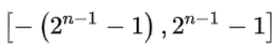
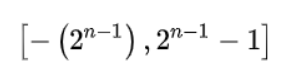
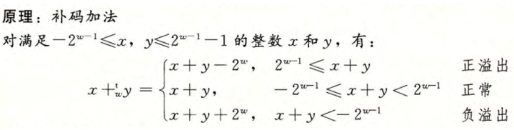

## **前言**

对于正数而言，原码，反码，补码都是一样的。但是对于负数而言，原码，反码，补码表示各有不同。

## **原码 （Sign and Magnitude）**

用左边第一位来表示符号（Sign），0为正数，1为负数。其余位表示大小（Magnitude）。

这里以用原码表示-56来举例：

1.  写出大小的二进制表示 56的二进制表示是0011 1000（默认8 bit）
2.  把左边第一位改成1 [-56]原 = 1011 1000

其他例子： [+1]原 = 0000 0001 [-1]原 = 1000 0001

### **取值范围**

由于第一位是符号位, 所以用原码表示时，取值范围为： [111..11, 011..11]

对于8 bit来说取值范围就是 [1111 1111 , 0111 1111] = [-127 , 127]

### **原码表示负数的问题**

用原码表示负数时会出现几个问题：

1.  该怎么表示0？ 这时候0可以有两种表示方法，0000 0000 （+0）和 1000 0000 （-0）
2.  运算不方便 考虑加法的三种种情况，可以知道对于每种情况，运算的方式都不同，这就造成了设计上的不方便
    -   A+B (A是正数，B是正数) 正数时正常加（Add Normal） [0001]原 + [0001]原 = [0010]原
    -   A+B (A是正数，B是负数) 此时要把加法变为减法，再拿数值相减 11 + (-6) = [01011]原 + [10110]原 = 1011 - 0110 = 0101 = 5
    -   A+B (A是负数，B是负数) 此时要正常相加数值，最后要保留符号 -3 + （-4）= [10011]原 + [10100]原 = 0011 + 0100 = 0111 = -7

## **反码 (Ones' complement)**

关于反码有两种做法：

### **第一种**

还是拿-56举例：

1.  把大小转换成二进制 （Encode the positive value to binary） 56的二进制表示是0011 1000
2.  反转所有位 （Flip all bits） [-56]反 = 1100 0111

### **第二种**

负数的反码是在其原码的基础上，符号位不变，其余位取反。

 [+1] = [0000 0001]原 = [0000 0001]反 [-1] = [1000 0001]原 = [1111 1110]反 [-56] = [1011 1000]原 = [1100 0111]反

### **反码表示负数的问题**

用反码表示负数时也会有跟原码一样的问题：

1.  该怎么表示0？ 这时候0可以有两种表示方法，0000 0000 和 1111 1111

2.  加法，减法，乘法，除法并不直观 

    拿 (+1) + （-1）举例： 我们期待 (+1) + （-1）= 0 但是，(+1) + （-1）= 0000 0001 + 1111 1110 = 1111 1111 = -0

## **补码 (Two's complement)**

关于补码有两种做法：

### **第一种**

-   整数转补码

    还是拿-56举例：

    1.   把大小转换成二进制 （Encode the positive value to binary） 56的二进制表示是0011 1000
    2.   反转所有位 （Flip all bits） [-56]反 = 1100 0111
    3.   加一 （Add one） [-56]补 = 1100 1000

-   把补码转成整数：
    1.   反转所有位 （Flip all bits） 1101 0100 -> 0010 1011
    2.   加一 （Add one） 0010 1011 + 1 = 0010 1100
    3.   转换成大小 0010 1100 = 44
    4.   加上负号 [1101 0100]补 = -44

### **第二种**

-   整数转补码

    这边以-14的补码表示举例：

    1.   写成原码，改变符号位 14 = 0000 1110 [-14]原 = [1000 1110]
    2.   出符号位外，各个位取反 [-14]反 = [1111 0001]
    3.   反码加一 [-14]补 = [1111 0010]

-   从补码推到原码 

    以推导-69举例： [1011 1011]补

    1.   减一变成反码 [1011 1010]反
    2.   除符号外取反 [1100 0101]原 = -（1+4+64） = -69

### **补码的范围**

[100..00, 011...1]

也就是说[-1]补 = [1111 1111], 负数的取值范围变成了[1000 0000, 1111 1111]

### **补码的好处**

1.  运算方便 -56 + 12 = [1100 1000]补 + [0000 1100]补 = [1101 0100]补 = -44 28 + （-26）= [0001 1100]补 + [1110 0110]补 = [1 0000 0010]补 = [0000 0010] = 2
2.  拿补码和正数可以加一个溢出的零，0只有一个code表示 1+-1 = [0000 0001]补 + [1111 1111]补 = [1 0000 0000]补 = [0000 0000] = 0

ps: 这里溢出的1会被截断

3.   能将字的最高有效位解释为负权

     [0001] = -0 * (2^3) + 0 * (2^2) + 0 * (2^1) + 1 * (2^0) = 0 + 0 + 0 + 1 = 1

     [1111] = -1 * (2^3) + 1 * (2^2) + 1 * (2^1) + 1 * (2^0) = -8 + 4 + 2 + 1 = -1

